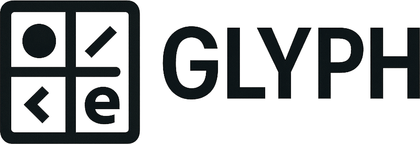

<picture>
  <source srcset="docs/assets/logo_white.png" media="(prefers-color-scheme: dark)">
  
</picture>

# Glyph Language & Engine

Welcome to Glyph—a modern, Python-inspired programming language and modular development engine for games, simulations, and real-time systems.

---

## Key Features
- **Entity-Component-System (ECS) built-in**
- **Clean, Python-like syntax**
- **Pattern matching, async/await, traits/interfaces, macros, and more**
- **Visual scripting (AST ↔ node sync)**
- **Hot-reload, live coding, and multiplayer support**
- **Extensible standard library and FFI**
- **Rich editor integration (Monaco, VSCode, LSP)**

---

## Documentation
Full documentation is available at: [Glyph Docs Site](https://kyles-personal-organization.gitbook.io/glyph)

Or see the `/docs` folder for Markdown source files.

---

## Community & Support
- **Discussion Forum:** [link-to-forum]
- **Chat:** [link-to-chat]
- **GitHub Issues:** [link-to-issues]
- **Roadmap & Voting:** [link-to-roadmap]

---

Glyph is open source, released under the MIT License.

---

*Logo and icon assets are in `/docs/assets/`.* 