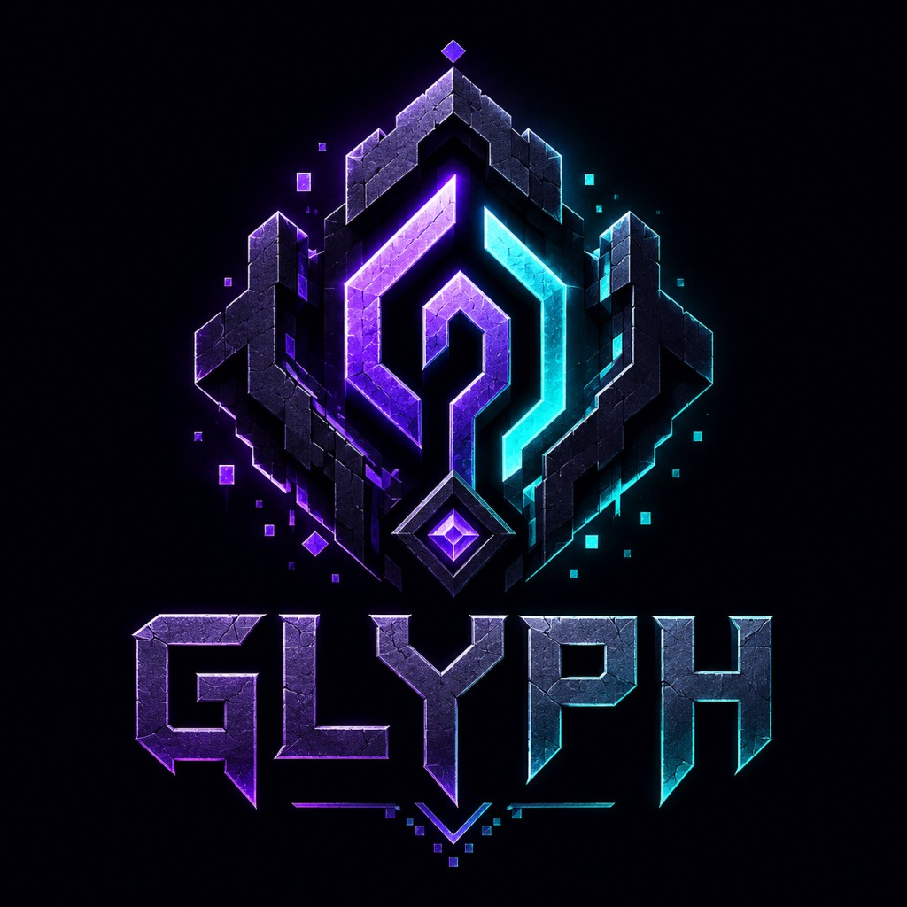

<p align="center"></p>

# Glyph Server

Persistent anarchy/economy Minecraft network. Folia backend, Velocity proxy,
PostgreSQL + Redis, custom `GlyphCore` plugin.

The full specification lives in [`docs/GDD.md`](docs/GDD.md). Architectural
deviations from the GDD are recorded in [`docs/DECISIONS.md`](docs/DECISIONS.md).

## Modules

| Module        | What it is                                                            |
|---------------|-----------------------------------------------------------------------|
| `glyph-api`   | Public API for trusted plugins (interfaces only, no implementation)   |
| `glyph-core`  | Folia plugin: config, scheduling, PostgreSQL, Redis, health, player identity |
| `glyph-proxy` | Velocity plugin: proxy-side platform foundation                       |

Supporting directories: `database/` (schema docs), `docker/` (production
images + compose stack, see [`docs/DEPLOYMENT.md`](docs/DEPLOYMENT.md)),
`scripts/` (dev helpers + backups + staging smoke), `docs/` (GDD,
[staging](docs/STAGING.md), [world](docs/WORLD.md), decisions).

Players: the optional client modpack (voice chat, maps, performance) lives at
[KyleLandon/glyph-clientmods](https://github.com/KyleLandon/glyph-clientmods)
with a self-updating install script.

## Requirements

- **JDK 25** (Temurin or equivalent; GDD requires Java 21+)
- **Docker** (for local PostgreSQL/Redis and integration tests) — optional but recommended

## Quick start (new machine)

```powershell
git clone <repo-url> Glyph-Server
cd Glyph-Server

# 1. Environment
Copy-Item .env.example .env     # then edit passwords

# 2. Infrastructure (needs Docker Desktop)
scripts\dev-up.ps1              # starts PostgreSQL + Redis

# 3. Build + tests (Gradle wrapper is committed — no Gradle install needed)
.\gradlew build
```

The local test servers (`glyph-folia/`, `glyph-velocity/`) are in git
including server jars, configs and plugins — only world data, logs, caches
and the forwarding secret are excluded. On a new machine follow the quick
start in [`docs/LOCAL_TEST_SERVER.md`](docs/LOCAL_TEST_SERVER.md) (run each
server once, then `scripts\sync-forwarding-secret.ps1`). Requires JDK 25 on
PATH.

Artifacts:

- `glyph-core/build/libs/glyph-core-<version>.jar` → Folia `plugins/`
- `glyph-proxy/build/libs/glyph-proxy-<version>.jar` → Velocity `plugins/`

`GlyphCore` declares its runtime libraries (HikariCP, Flyway, PostgreSQL
driver, Lettuce) in `plugin.yml`; the server downloads them from Maven Central
at first startup — no shading.

## Configuration

`plugins/GlyphCore/` contains `config.yml`, `database.yml`, `redis.yml`
(created with defaults on first start). Every value can be overridden with
environment variables — env always wins:

| Variable               | Meaning                          |
|------------------------|----------------------------------|
| `GLYPH_SERVER_ID`      | Backend server identifier        |
| `GLYPH_DB_HOST`        | PostgreSQL host                  |
| `GLYPH_DB_PORT`        | PostgreSQL port                  |
| `GLYPH_DB_DATABASE`    | Database name                    |
| `GLYPH_DB_USERNAME`    | Database user (not a superuser!) |
| `GLYPH_DB_PASSWORD`    | Database password                |
| `GLYPH_REDIS_HOST`     | Redis host                       |
| `GLYPH_REDIS_PORT`     | Redis port                       |
| `GLYPH_REDIS_PASSWORD` | Redis password                   |

Secrets belong in the environment or secret storage, never in git
(GDD section 119).

## Database migrations

Flyway migrations live in
`glyph-core/src/main/resources/db/migration/` (`V1__initial_schema.sql`, ...).
They run automatically and asynchronously when GlyphCore starts. Never modify
the production schema manually (GDD section 48).

## Testing

```powershell
./gradlew test
```

- Unit tests (config, health aggregation) always run.
- Integration tests (`*IT`: real PostgreSQL/Redis via Testcontainers) run when
  Docker is available and are skipped otherwise. CI (GitHub Actions,
  `.github/workflows/build.yml`) runs everything.

## In-game

`/glyph status` (permission `glyph.admin`) reports PostgreSQL/Redis health;
`/glyph version` shows build info. Health checks run on async I/O threads and
report back through the player's entity scheduler — no tick-thread blocking.

Player identity (Phase 2): every join upserts the player's row in `players`
(username, `last_join`, `last_seen`) and creates their economy account on
first join; quits persist `last_seen` and accumulated playtime. All writes are
asynchronous, and a database outage degrades gracefully (events are logged and
skipped, gameplay continues).

Economy (Phase 3): `/balance` (`/bal`), `/pay <player> <amount>`, `/baltop`,
`/money history`, and `/eco get|set|add|remove` for admins (permission
`glyph.economy.admin`, every adjustment ledgered and logged). Transfers are
atomic PostgreSQL transactions with row locks and idempotency keys; amounts
are BIGINT whole dollars (the economy has no cents), never floats. An action-bar
HUD shows each player's cash above the hotbar (keeps clear of client minimaps)
and updates live on any balance change (configure under `economy.hud`).

When VaultUnlocked is installed, GlyphCore registers a classic Vault economy
provider (`GlyphEconomy`) so third-party plugins can use Glyph balances;
their deposits/withdrawals are ledgered as SYSTEM_REWARD/SYSTEM_SINK
(see `docs/DECISIONS.md` ADR-009).

## Development rules (short version)

1. This repo follows `docs/GDD.md`; correctness → stability → exploit
   resistance → performance → maintainability → features.
2. All Minecraft-touching code must be Folia-safe: use
   `SchedulerAdapter` (global/region/entity/async), never assume a main thread.
3. No blocking I/O on tick threads. Ever.
4. Money is BIGINT whole dollars — no cents. No floats, no exceptions.
5. PostgreSQL is the source of truth; Redis is cache/messaging only.
6. Every schema change is a new Flyway migration.
7. Features touching money/items/permissions require tests before merge.
